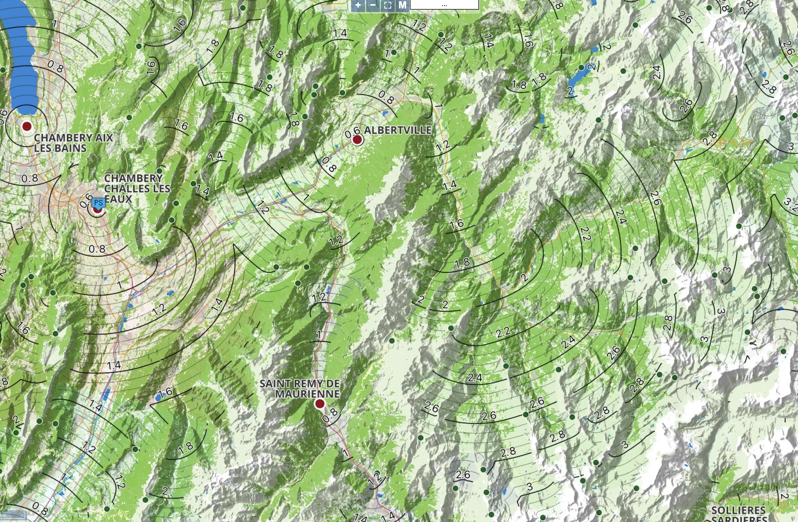
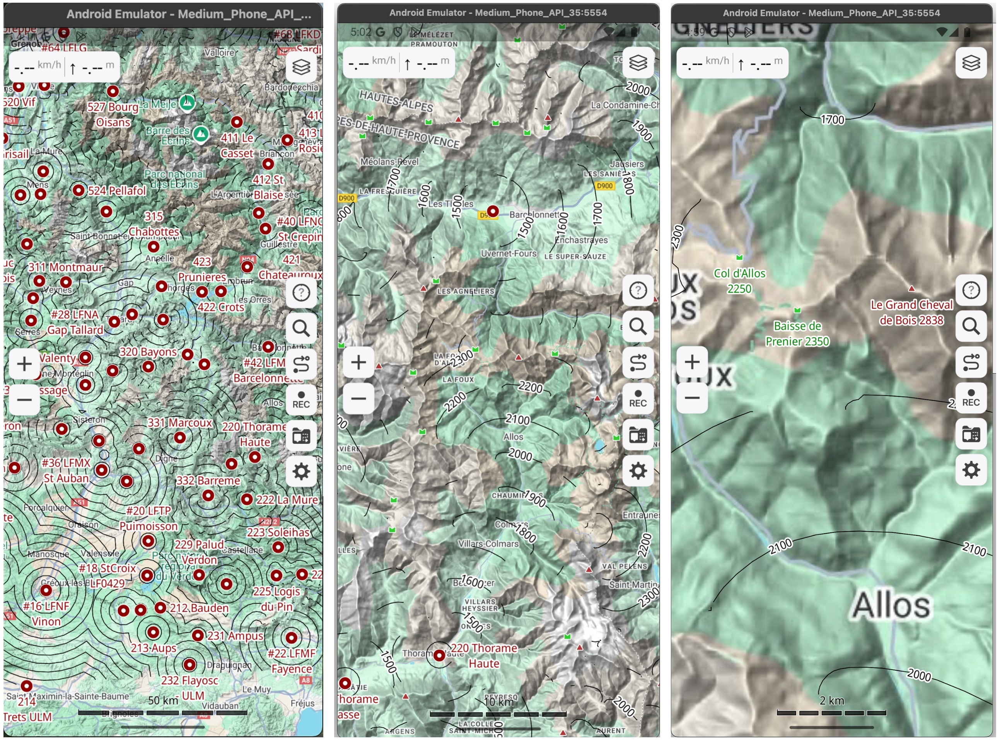

# MountainCircles

This project is the continuation of a project that ended up in early 2024 with this interactive map covering the full Alps (different information at different zoom levels):
https://live.glidernet.org/#c=45.26242,7.67261&z=7&m=4&s=1



you can still download the "alpes 600dpi 2.mbtiles" at https://drive.google.com/drive/folders/1fr68iDfBMsFurlEx9bBe8ZorvOEG9Lc7?usp=sharing and share this file on your phone with Guru Maps, a free android and iphone app that allows custom map import in MBTiles format. 
That map has the following parameters:
- glide ratio : 20
- ground clearance: 200m
- circuit height: 250m

The objective has now shifted to providing a way to quickly compute a file to display, with everyone its own glide parameters, and eveyone its own list of airfields.

# Today
for quicker export, we just have vector layers that we can switch on and off in Guru Maps:



## How to download
- from your phone:
- install Guru Maps
- go to https://drive.google.com/drive/folders/1nf3-rh1FVG5X43KMUsyvlxcQL0Tnapjj?usp=drive_link
- find the layers you want (f20 - gas0 - s250 means glide ratio 20, ground clearance 0m, circuit height 250m) [*west alps has both fields and outlanding fields*]
- for any layer, download both **the geojson** (the data) **+ the mapcss** (the style)
- share the files with Guru Maps previously installed  (go to your files explorer application -download folder- and select the files and share if needed)
- in Guru Maps, the files should be found in the overlay section, which means you can choose the background layer that you want.
- i also suggest adding "google maps terrain HD" background. --> https://ms.gurumaps.app/ -->share the downloaded file with guru maps

### Notes on the peaks and passes layers
- the peaks are a decluttered version of the OSM database, designed to keep only the highest one 5km around
- the passes were computed to be "all the key points to glide back to an airfield, with L/D 20, 25, 30)


# If you want to contribute, or run the code yourself to choose you own airfields and glide parameters:

### Requirements to make this work so far:

- In the main folder, there are already built C++ files: "compute" (for mac), and "compute.exe" (for windows)
- comment/uncomment the proper lines:
``` 
  #for mac:
  compute: ./compute
  # for windows:
  # compute: ./compute.exe 
 ```
- continue following the instructions, if you get an error when trying to run, or want to modify the C++, you might have to build again yourself (see further down)
- create a conda environnement with the latest python, activate it, and run:
- ``` conda install conda-forge::pyyaml```
- ``` conda install conda-forge::pyproj```
- ``` conda install conda-forge::numpy```
- ``` conda install conda-forge::gdal```
- add https://drive.google.com/file/d/1-VK5xH8YsDiYMH_TTw0kfHIHoiT12Jh2/view?usp=sharing in the topography folder

- check the file pathes in the yaml configuration files 
- ```reset_results: true``` starts by deleting the results of the previous run you launched with this config
- start with albertville.yaml for just one airfield, then three.yaml is... 3 airfields.. yeah you got it


``` 
python launch.py [config].yaml
 ```


### Compiling C++ on mac with VSCode
- check or install xcode
- open vscode -> open folder ->C++ to build
- open compute.cpp, agree to install C++ extension.., open command palette -> run build task -> select clang++ -> it should build, read the output, you should have "build successful"
- move compute to the main folder or change the path in the yaml config files.

### Compiling C++ in windows with VSCode
- As a mac user, through a windows 11 virtual machine, vscode couldn't build the C++ as is. 
- I followed the recommendations to install visual studio build tools. windows had to restart to complete installation. 
- **-->Then do not launch VSCode from the desktop shortcut<--** 
- Do Windows -> search for "Developer Command Prompt for VS", type in ```cl``` to make sure it is installed and responding, you should see a version number, and not an error. 
- Then navigate in command line to the folder where you have cloned the repository, do ```code .```, and now VSCode has access to the C++ build tools and will offer them to you.
- open compute.cpp, agree to install C++ extension.., open command palette -> run build task -> select the only option you are offered -> it should build, read the output, you should have "build successful"
- move compute.exe to the main folder or change the path in the yaml config files.


# Usage

### A run with several airfields will provide:
- a "local" calculation for each individual airfield as "local.asc" (topology of the local) and "airfieldName.gpkg" (the contour lines).
- a recombined topology for all the airfields, and its contour lines, as .asc and .gpkg in the root folder of the calculation results.
- all in the Coordinate Reference System specified in the yaml config file

### With ```gurumaps: true``` in the yaml config file, it will provide as well:
- a geojson conversion of the contour lines for all output, in the right CRS for Guru Maps (EPSG:4326)
- a .mapcss style file of the same name
- names ending with _airfields also have airfields to display

### .mapcss styles
- found in /templates
- they are copied alongside each geojson, named identically, after calculations, for quicker export
- Guru Maps docs: https://gurumaps.app/docs/mapcss
- when playing with the styles, i found out that using android studio's emulator was quicker than exporting to real phone. Some mapcss crashed the app consistently -> clear all app data, or uninstall/reinstall


# to do next

- get the missing eastern bit of the alp
- see if polygon export is viable in the geojson to color the map for each airfield
- add the ability to choose individual glide/ground clearance/circuit height for each airfield
- long term: make a self contained executable
- add airspace. we could start with airspace connected to the ground (P areas, national/regional parks)


# Disclaimer:

this is unchecked amateur work, altitudes could be wrong, find a way to check that you are happy with the results if you fly with it.

# Credits
https://github.com/planeur-net/outlanding for the west alps cup file
